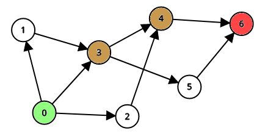

<!-- HStar Algorithm -->

<!-- Logo -->


<!-- Title -->
# HStar Algorithm
[![license-badge]][license-url] [![c-badge]][c-url] [![meson-badge]][meson-url]
<!-- Short Description -->
> A simple implementation of the [A*][astar-url] algorithm.

<!-- Description -->
This project was developed as a solution for an assignment in the subject of artificial intelligence using the [C][c-url] programming language and [Meson][meson-url] bulid system.

## Graph
> Graph used as example for the execution of the algorithm



> **Green**: start
>
> **Orange**: path
>
> **Red**: target

## Visualization
> Graphical visualization of the [A*][astar-url] in action


> **Green**: start
>
> **Orange**: path
>
> **Gray**: visited
>
> **Red**: target

## Dependencies
> [A*][astar-url] algorithm
 - [GLib][glib-url]

> Visualization
 - [RayLib][raylib-url]

## Build Instructions
> Configure
```sh
    meson setup build
```

> Compile
```sh
    ninja -C build
```

> Run **[simple]**
```sh
    ./build/hstar
```

> Run **[visualization]**
```sh
    ./build/visualization
```

<!-- Links -->
[license-url]: https://opensource.org/licenses/BSD-3-Clause
[c-url]: https://en.cppreference.com/w/c
[meson-url]: https://mesonbuild.com/
[astar-url]: https://en.wikipedia.org/wiki/A*_search_algorithm
[glib-url]: https://gitlab.gnome.org/GNOME/glib
[raylib-url]: https://github.com/raysan5/raylib

<!-- Badges -->
[license-badge]: https://img.shields.io/badge/license-BSD_3_Clause-blue.svg?style=flat-square
[meson-badge]: https://img.shields.io/badge/Meson-0.62-07508d.svg?style=flat-square
[c-badge]: https://img.shields.io/badge/C-11-orange.svg?style=flat-square
